# Globalin 프로젝트 상세 클래스 다이어그램

## 목차
1. [전체 아키텍처](#1-전체-아키텍처)
2. [모델 계층 (Model Layer)](#2-모델-계층-model-layer)
3. [DAO 계층 (Data Access Object Layer)](#3-dao-계층-data-access-object-layer)
4. [서비스 계층 (Service Layer)](#4-서비스-계층-service-layer)
5. [컨트롤러 계층 (Controller Layer)](#5-컨트롤러-계층-controller-layer)
6. [DTO 계층 (Data Transfer Object)](#6-dto-계층-data-transfer-object)
7. [설정 및 유틸리티](#7-설정-및-유틸리티)
8. [데이터베이스 ERD](#8-데이터베이스-erd)

---

## 1. 전체 아키텍처

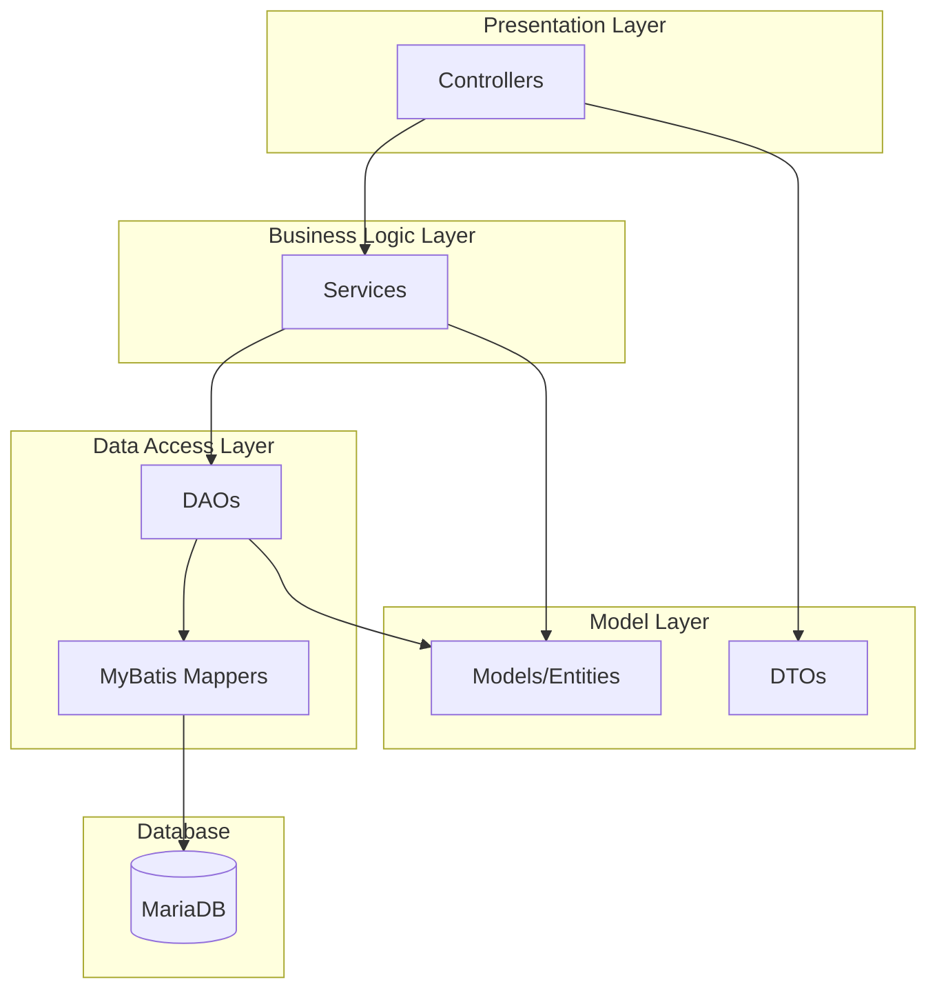
```mermaid
graph TB
    subgraph "Presentation Layer"
        C[Controllers]
    end

    subgraph "Business Logic Layer"
        S[Services]
    end

    subgraph "Data Access Layer"
        D[DAOs]
        M[MyBatis Mappers]
    end

    subgraph "Database"
        DB[(MariaDB)]
    end

    subgraph "Model Layer"
        MO[Models/Entities]
        DTO[DTOs]
    end

    C --> S
    C --> DTO
    S --> D
    S --> MO
    D --> M
    M --> DB
    D --> MO
```

**아키텍처 패턴**: Layered Architecture (계층형 아키텍처)
- **Controller**: HTTP 요청/응답 처리, 세션 관리
- **Service**: 비즈니스 로직, 트랜잭션 관리
- **DAO**: 데이터베이스 접근, CRUD 연산
- **Model**: 도메인 엔티티
- **DTO**: 데이터 전송 객체

---

## 2. 모델 계층 (Model Layer)

### 2.1 User (사용자)

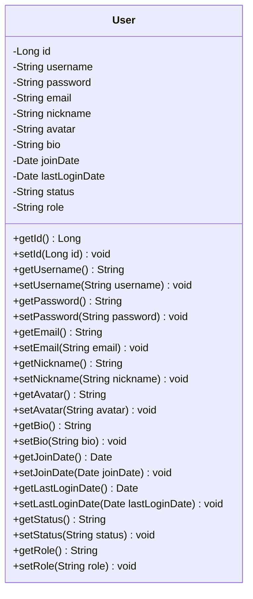
```mermaid
classDiagram
    class User {
        -Long id
        -String username
        -String password
        -String email
        -String nickname
        -String avatar
        -String bio
        -Date joinDate
        -Date lastLoginDate
        -String status
        -String role

        +getId() Long
        +setId(Long id) void
        +getUsername() String
        +setUsername(String username) void
        +getPassword() String
        +setPassword(String password) void
        +getEmail() String
        +setEmail(String email) void
        +getNickname() String
        +setNickname(String nickname) void
        +getAvatar() String
        +setAvatar(String avatar) void
        +getBio() String
        +setBio(String bio) void
        +getJoinDate() Date
        +setJoinDate(Date joinDate) void
        +getLastLoginDate() Date
        +setLastLoginDate(Date lastLoginDate) void
        +getStatus() String
        +setStatus(String status) void
        +getRole() String
        +setRole(String role) void
    }
```

**필드 설명**:
- `id`: 사용자 고유 ID (Primary Key)
- `username`: 로그인 아이디 (4-20자, UNIQUE)
- `password`: BCrypt 암호화된 비밀번호
- `email`: 이메일 주소 (UNIQUE)
- `nickname`: 표시용 닉네임
- `avatar`: 프로필 이미지 URL
- `bio`: 자기소개
- `joinDate`: 가입일
- `lastLoginDate`: 마지막 로그인 시간
- `status`: 계정 상태 (ACTIVE, INACTIVE, BANNED)
- `role`: 권한 (USER, ADMIN)

---

### 2.2 Post (게시글)

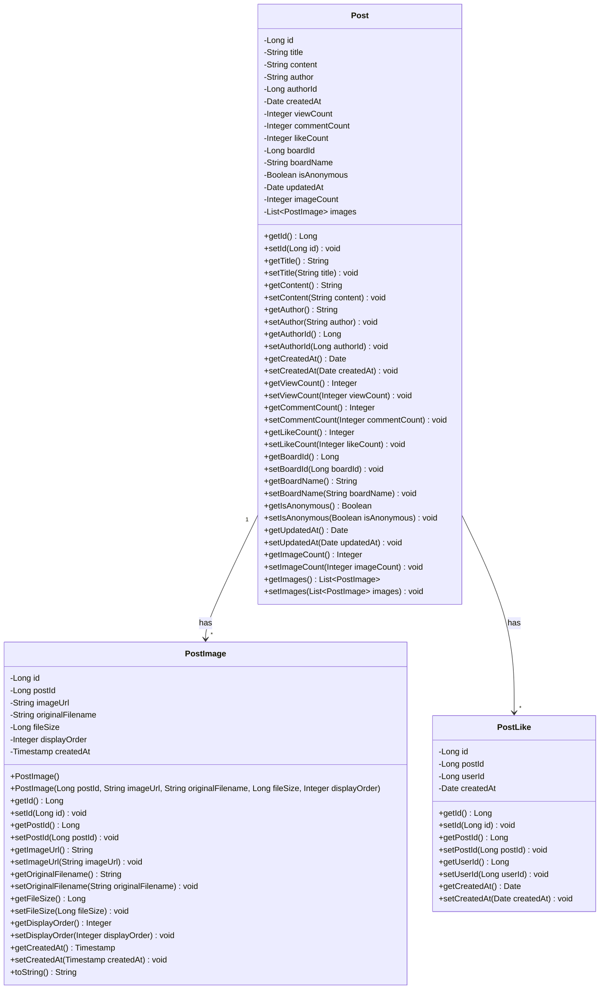
```mermaid
classDiagram
    class Post {
        -Long id
        -String title
        -String content
        -String author
        -Long authorId
        -Date createdAt
        -Integer viewCount
        -Integer commentCount
        -Integer likeCount
        -Long boardId
        -String boardName
        -Boolean isAnonymous
        -Date updatedAt
        -Integer imageCount
        -List~PostImage~ images

        +getId() Long
        +setId(Long id) void
        +getTitle() String
        +setTitle(String title) void
        +getContent() String
        +setContent(String content) void
        +getAuthor() String
        +setAuthor(String author) void
        +getAuthorId() Long
        +setAuthorId(Long authorId) void
        +getCreatedAt() Date
        +setCreatedAt(Date createdAt) void
        +getViewCount() Integer
        +setViewCount(Integer viewCount) void
        +getCommentCount() Integer
        +setCommentCount(Integer commentCount) void
        +getLikeCount() Integer
        +setLikeCount(Integer likeCount) void
        +getBoardId() Long
        +setBoardId(Long boardId) void
        +getBoardName() String
        +setBoardName(String boardName) void
        +getIsAnonymous() Boolean
        +setIsAnonymous(Boolean isAnonymous) void
        +getUpdatedAt() Date
        +setUpdatedAt(Date updatedAt) void
        +getImageCount() Integer
        +setImageCount(Integer imageCount) void
        +getImages() List~PostImage~
        +setImages(List~PostImage~ images) void
    }

    class PostImage {
        -Long id
        -Long postId
        -String imageUrl
        -String originalFilename
        -Long fileSize
        -Integer displayOrder
        -Timestamp createdAt

        +PostImage()
        +PostImage(Long postId, String imageUrl, String originalFilename, Long fileSize, Integer displayOrder)
        +getId() Long
        +setId(Long id) void
        +getPostId() Long
        +setPostId(Long postId) void
        +getImageUrl() String
        +setImageUrl(String imageUrl) void
        +getOriginalFilename() String
        +setOriginalFilename(String originalFilename) void
        +getFileSize() Long
        +setFileSize(Long fileSize) void
        +getDisplayOrder() Integer
        +setDisplayOrder(Integer displayOrder) void
        +getCreatedAt() Timestamp
        +setCreatedAt(Timestamp createdAt) void
        +toString() String
    }

    class PostLike {
        -Long id
        -Long postId
        -Long userId
        -Date createdAt

        +getId() Long
        +setId(Long id) void
        +getPostId() Long
        +setPostId(Long postId) void
        +getUserId() Long
        +setUserId(Long userId) void
        +getCreatedAt() Date
        +setCreatedAt(Date createdAt) void
    }

    Post "1" --> "*" PostImage : has
    Post "1" --> "*" PostLike : has
```

**필드 설명**:

**Post**:
- `id`: 게시글 고유 ID
- `title`: 게시글 제목
- `content`: 게시글 본문
- `author`: 작성자 닉네임 (조인 데이터)
- `authorId`: 작성자 ID (FK to users.id)
- `createdAt`: 작성일시
- `viewCount`: 조회수
- `commentCount`: 댓글 수
- `likeCount`: 좋아요 수
- `boardId`: 게시판 ID (FK to boards.id)
- `boardName`: 게시판 이름 (조인 데이터)
- `isAnonymous`: 익명 여부
- `updatedAt`: 수정일시
- `imageCount`: 첨부 이미지 수
- `images`: 첨부 이미지 목록

**PostImage**:
- `id`: 이미지 고유 ID
- `postId`: 게시글 ID (FK to posts.id)
- `imageUrl`: 이미지 URL (/uploads/...)
- `originalFilename`: 원본 파일명
- `fileSize`: 파일 크기 (bytes)
- `displayOrder`: 표시 순서 (0부터 시작)
- `createdAt`: 업로드 일시

**PostLike**:
- `id`: 좋아요 고유 ID
- `postId`: 게시글 ID (FK to posts.id)
- `userId`: 사용자 ID (FK to users.id)
- `createdAt`: 좋아요 누른 시간

---

### 2.3 Comment (댓글)

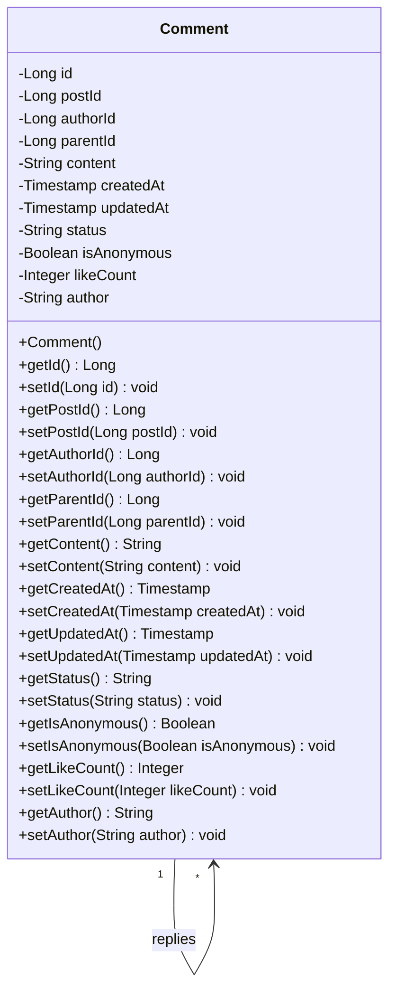
```mermaid
classDiagram
    class Comment {
        -Long id
        -Long postId
        -Long authorId
        -Long parentId
        -String content
        -Timestamp createdAt
        -Timestamp updatedAt
        -String status
        -Boolean isAnonymous
        -Integer likeCount
        -String author

        +Comment()
        +getId() Long
        +setId(Long id) void
        +getPostId() Long
        +setPostId(Long postId) void
        +getAuthorId() Long
        +setAuthorId(Long authorId) void
        +getParentId() Long
        +setParentId(Long parentId) void
        +getContent() String
        +setContent(String content) void
        +getCreatedAt() Timestamp
        +setCreatedAt(Timestamp createdAt) void
        +getUpdatedAt() Timestamp
        +setUpdatedAt(Timestamp updatedAt) void
        +getStatus() String
        +setStatus(String status) void
        +getIsAnonymous() Boolean
        +setIsAnonymous(Boolean isAnonymous) void
        +getLikeCount() Integer
        +setLikeCount(Integer likeCount) void
        +getAuthor() String
        +setAuthor(String author) void
    }

    Comment "1" --> "*" Comment : replies
```

**필드 설명**:
- `id`: 댓글 고유 ID
- `postId`: 게시글 ID (FK to posts.id)
- `authorId`: 작성자 ID (FK to users.id)
- `parentId`: 부모 댓글 ID (대댓글인 경우, FK to comments.id)
- `content`: 댓글 내용
- `createdAt`: 작성일시
- `updatedAt`: 수정일시
- `status`: 상태 (ACTIVE, DELETED)
- `isAnonymous`: 익명 여부
- `likeCount`: 좋아요 수
- `author`: 작성자 닉네임 (조인 데이터)

---

### 2.4 Message (쪽지)

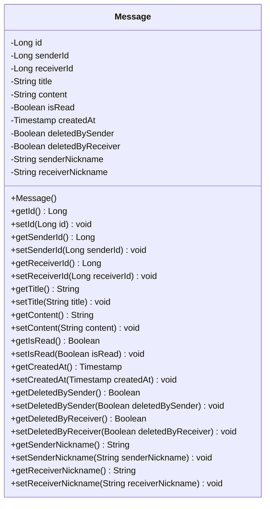
```mermaid
classDiagram
    class Message {
        -Long id
        -Long senderId
        -Long receiverId
        -String title
        -String content
        -Boolean isRead
        -Timestamp createdAt
        -Boolean deletedBySender
        -Boolean deletedByReceiver
        -String senderNickname
        -String receiverNickname

        +Message()
        +getId() Long
        +setId(Long id) void
        +getSenderId() Long
        +setSenderId(Long senderId) void
        +getReceiverId() Long
        +setReceiverId(Long receiverId) void
        +getTitle() String
        +setTitle(String title) void
        +getContent() String
        +setContent(String content) void
        +getIsRead() Boolean
        +setIsRead(Boolean isRead) void
        +getCreatedAt() Timestamp
        +setCreatedAt(Timestamp createdAt) void
        +getDeletedBySender() Boolean
        +setDeletedBySender(Boolean deletedBySender) void
        +getDeletedByReceiver() Boolean
        +setDeletedByReceiver(Boolean deletedByReceiver) void
        +getSenderNickname() String
        +setSenderNickname(String senderNickname) void
        +getReceiverNickname() String
        +setReceiverNickname(String receiverNickname) void
    }
```

**필드 설명**:
- `id`: 쪽지 고유 ID
- `senderId`: 발신자 ID (FK to users.id)
- `receiverId`: 수신자 ID (FK to users.id)
- `title`: 쪽지 제목
- `content`: 쪽지 내용
- `isRead`: 읽음 여부
- `createdAt`: 발송일시
- `deletedBySender`: 발신자 삭제 여부
- `deletedByReceiver`: 수신자 삭제 여부
- `senderNickname`: 발신자 닉네임 (조인 데이터)
- `receiverNickname`: 수신자 닉네임 (조인 데이터)

---

### 2.5 Report (신고)

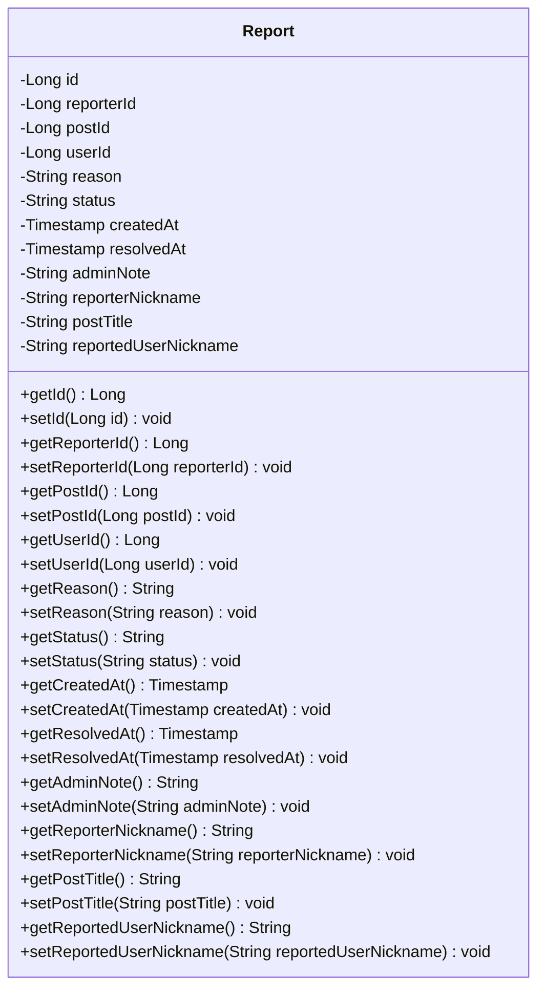
```mermaid
classDiagram
    class Report {
        -Long id
        -Long reporterId
        -Long postId
        -Long userId
        -String reason
        -String status
        -Timestamp createdAt
        -Timestamp resolvedAt
        -String adminNote
        -String reporterNickname
        -String postTitle
        -String reportedUserNickname

        +getId() Long
        +setId(Long id) void
        +getReporterId() Long
        +setReporterId(Long reporterId) void
        +getPostId() Long
        +setPostId(Long postId) void
        +getUserId() Long
        +setUserId(Long userId) void
        +getReason() String
        +setReason(String reason) void
        +getStatus() String
        +setStatus(String status) void
        +getCreatedAt() Timestamp
        +setCreatedAt(Timestamp createdAt) void
        +getResolvedAt() Timestamp
        +setResolvedAt(Timestamp resolvedAt) void
        +getAdminNote() String
        +setAdminNote(String adminNote) void
        +getReporterNickname() String
        +setReporterNickname(String reporterNickname) void
        +getPostTitle() String
        +setPostTitle(String postTitle) void
        +getReportedUserNickname() String
        +setReportedUserNickname(String reportedUserNickname) void
    }
```

**필드 설명**:
- `id`: 신고 고유 ID
- `reporterId`: 신고자 ID (FK to users.id)
- `postId`: 신고된 게시글 ID (FK to posts.id, nullable)
- `userId`: 신고된 사용자 ID (FK to users.id, nullable)
- `reason`: 신고 사유
- `status`: 처리 상태 (pending, resolved, rejected)
- `createdAt`: 신고일시
- `resolvedAt`: 처리일시
- `adminNote`: 관리자 메모
- `reporterNickname`: 신고자 닉네임 (조인 데이터)
- `postTitle`: 신고된 게시글 제목 (조인 데이터)
- `reportedUserNickname`: 신고된 사용자 닉네임 (조인 데이터)

---

### 2.6 Notification (알림)

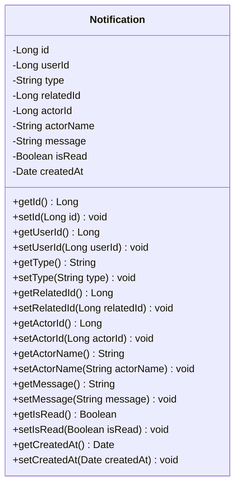
```mermaid
classDiagram
    class Notification {
        -Long id
        -Long userId
        -String type
        -Long relatedId
        -Long actorId
        -String actorName
        -String message
        -Boolean isRead
        -Date createdAt

        +getId() Long
        +setId(Long id) void
        +getUserId() Long
        +setUserId(Long userId) void
        +getType() String
        +setType(String type) void
        +getRelatedId() Long
        +setRelatedId(Long relatedId) void
        +getActorId() Long
        +setActorId(Long actorId) void
        +getActorName() String
        +setActorName(String actorName) void
        +getMessage() String
        +setMessage(String message) void
        +getIsRead() Boolean
        +setIsRead(Boolean isRead) void
        +getCreatedAt() Date
        +setCreatedAt(Date createdAt) void
    }
```

**필드 설명**:
- `id`: 알림 고유 ID
- `userId`: 알림 수신자 ID (FK to users.id)
- `type`: 알림 유형 (COMMENT, LIKE, REPLY)
- `relatedId`: 관련 객체 ID (댓글 ID, 게시글 ID 등)
- `actorId`: 알림 발생시킨 사용자 ID (FK to users.id)
- `actorName`: 알림 발생시킨 사용자 이름
- `message`: 알림 메시지
- `isRead`: 읽음 여부
- `createdAt`: 알림 생성일시

---

### 2.7 Timetable & Course (시간표 및 강의)

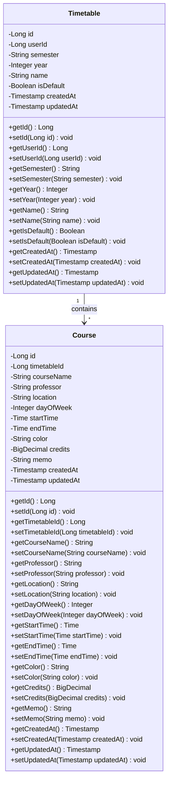
```mermaid
classDiagram
    class Timetable {
        -Long id
        -Long userId
        -String semester
        -Integer year
        -String name
        -Boolean isDefault
        -Timestamp createdAt
        -Timestamp updatedAt

        +getId() Long
        +setId(Long id) void
        +getUserId() Long
        +setUserId(Long userId) void
        +getSemester() String
        +setSemester(String semester) void
        +getYear() Integer
        +setYear(Integer year) void
        +getName() String
        +setName(String name) void
        +getIsDefault() Boolean
        +setIsDefault(Boolean isDefault) void
        +getCreatedAt() Timestamp
        +setCreatedAt(Timestamp createdAt) void
        +getUpdatedAt() Timestamp
        +setUpdatedAt(Timestamp updatedAt) void
    }

    class Course {
        -Long id
        -Long timetableId
        -String courseName
        -String professor
        -String location
        -Integer dayOfWeek
        -Time startTime
        -Time endTime
        -String color
        -BigDecimal credits
        -String memo
        -Timestamp createdAt
        -Timestamp updatedAt

        +getId() Long
        +setId(Long id) void
        +getTimetableId() Long
        +setTimetableId(Long timetableId) void
        +getCourseName() String
        +setCourseName(String courseName) void
        +getProfessor() String
        +setProfessor(String professor) void
        +getLocation() String
        +setLocation(String location) void
        +getDayOfWeek() Integer
        +setDayOfWeek(Integer dayOfWeek) void
        +getStartTime() Time
        +setStartTime(Time startTime) void
        +getEndTime() Time
        +setEndTime(Time endTime) void
        +getColor() String
        +setColor(String color) void
        +getCredits() BigDecimal
        +setCredits(BigDecimal credits) void
        +getMemo() String
        +setMemo(String memo) void
        +getCreatedAt() Timestamp
        +setCreatedAt(Timestamp createdAt) void
        +getUpdatedAt() Timestamp
        +setUpdatedAt(Timestamp updatedAt) void
    }

    Timetable "1" --> "*" Course : contains
```

**필드 설명**:

**Timetable**:
- `id`: 시간표 고유 ID
- `userId`: 사용자 ID (FK to users.id)
- `semester`: 학기 (1학기, 2학기, 여름학기, 겨울학기)
- `year`: 연도
- `name`: 시간표 이름
- `isDefault`: 기본 시간표 여부
- `createdAt`: 생성일시
- `updatedAt`: 수정일시

**Course**:
- `id`: 강의 고유 ID
- `timetableId`: 시간표 ID (FK to timetables.id)
- `courseName`: 강의명
- `professor`: 교수명
- `location`: 강의실
- `dayOfWeek`: 요일 (0=월, 1=화, 2=수, 3=목, 4=금, 5=토, 6=일)
- `startTime`: 시작 시간
- `endTime`: 종료 시간
- `color`: 시간표 표시 색상
- `credits`: 학점
- `memo`: 메모
- `createdAt`: 생성일시
- `updatedAt`: 수정일시

---

### 2.8 LectureReview (강의평)

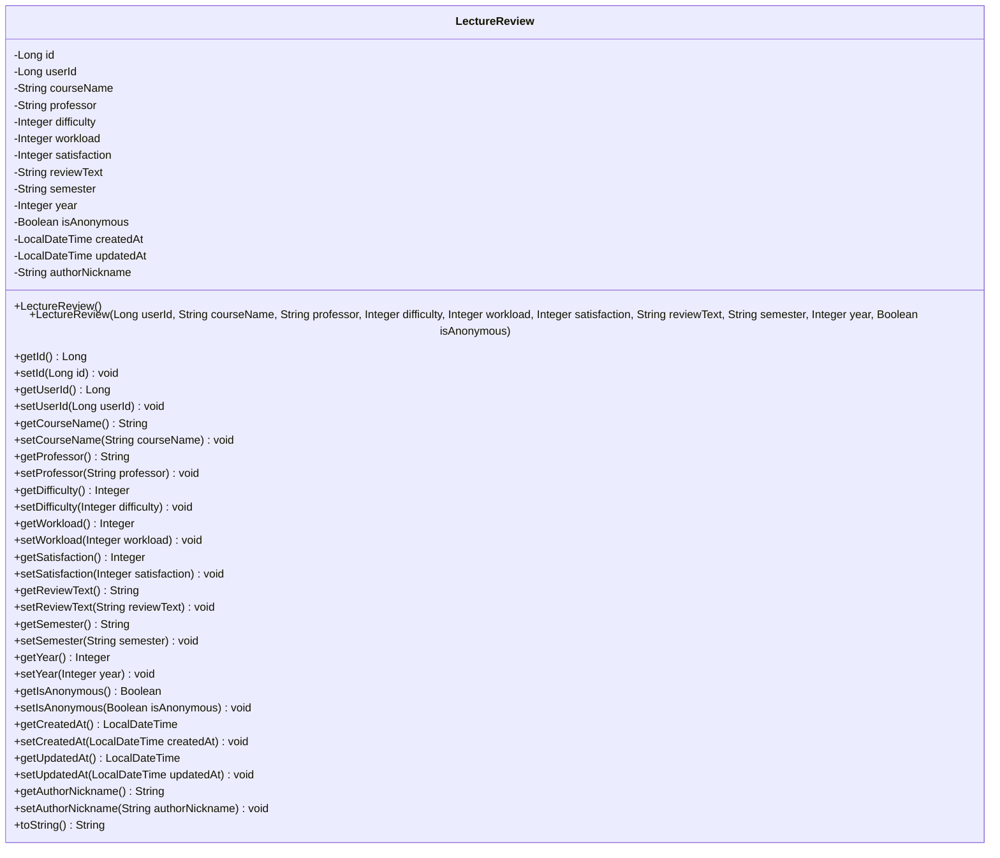
```mermaid
classDiagram
    class LectureReview {
        -Long id
        -Long userId
        -String courseName
        -String professor
        -Integer difficulty
        -Integer workload
        -Integer satisfaction
        -String reviewText
        -String semester
        -Integer year
        -Boolean isAnonymous
        -LocalDateTime createdAt
        -LocalDateTime updatedAt
        -String authorNickname

        +LectureReview()
        +LectureReview(Long userId, String courseName, String professor, Integer difficulty, Integer workload, Integer satisfaction, String reviewText, String semester, Integer year, Boolean isAnonymous)
        +getId() Long
        +setId(Long id) void
        +getUserId() Long
        +setUserId(Long userId) void
        +getCourseName() String
        +setCourseName(String courseName) void
        +getProfessor() String
        +setProfessor(String professor) void
        +getDifficulty() Integer
        +setDifficulty(Integer difficulty) void
        +getWorkload() Integer
        +setWorkload(Integer workload) void
        +getSatisfaction() Integer
        +setSatisfaction(Integer satisfaction) void
        +getReviewText() String
        +setReviewText(String reviewText) void
        +getSemester() String
        +setSemester(String semester) void
        +getYear() Integer
        +setYear(Integer year) void
        +getIsAnonymous() Boolean
        +setIsAnonymous(Boolean isAnonymous) void
        +getCreatedAt() LocalDateTime
        +setCreatedAt(LocalDateTime createdAt) void
        +getUpdatedAt() LocalDateTime
        +setUpdatedAt(LocalDateTime updatedAt) void
        +getAuthorNickname() String
        +setAuthorNickname(String authorNickname) void
        +toString() String
    }
```

**필드 설명**:
- `id`: 강의평 고유 ID
- `userId`: 작성자 ID (FK to users.id)
- `courseName`: 강의명
- `professor`: 교수명
- `difficulty`: 난이도 (1-5)
- `workload`: 과제량 (1-5)
- `satisfaction`: 만족도 (1-5)
- `reviewText`: 리뷰 내용
- `semester`: 수강 학기
- `year`: 수강 연도
- `isAnonymous`: 익명 여부
- `createdAt`: 작성일시
- `updatedAt`: 수정일시
- `authorNickname`: 작성자 닉네임 (조인 데이터)

---

### 2.9 Board (게시판)

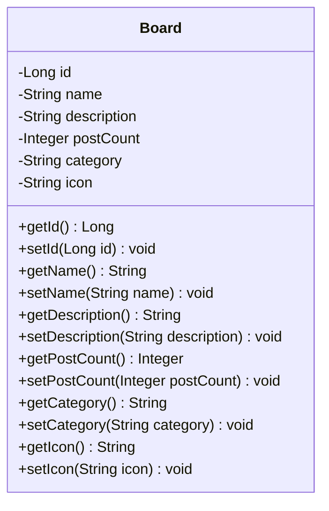
```mermaid
classDiagram
    class Board {
        -Long id
        -String name
        -String description
        -Integer postCount
        -String category
        -String icon

        +getId() Long
        +setId(Long id) void
        +getName() String
        +setName(String name) void
        +getDescription() String
        +setDescription(String description) void
        +getPostCount() Integer
        +setPostCount(Integer postCount) void
        +getCategory() String
        +setCategory(String category) void
        +getIcon() String
        +setIcon(String icon) void
    }
```

**필드 설명**:
- `id`: 게시판 고유 ID
- `name`: 게시판 이름
- `description`: 게시판 설명
- `postCount`: 게시글 수
- `category`: 카테고리
- `icon`: 아이콘

---

### 2.10 ChatMessage (채팅 메시지)

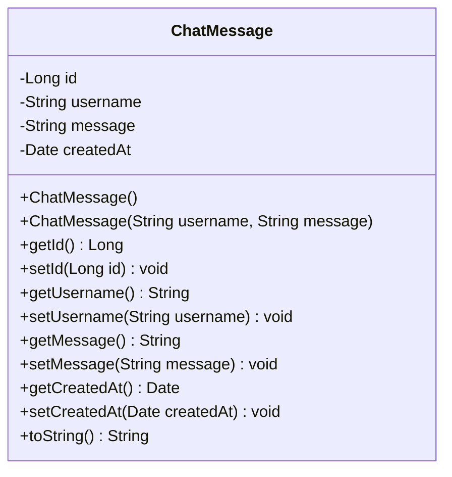
```mermaid
classDiagram
    class ChatMessage {
        -Long id
        -String username
        -String message
        -Date createdAt

        +ChatMessage()
        +ChatMessage(String username, String message)
        +getId() Long
        +setId(Long id) void
        +getUsername() String
        +setUsername(String username) void
        +getMessage() String
        +setMessage(String message) void
        +getCreatedAt() Date
        +setCreatedAt(Date createdAt) void
        +toString() String
    }
```

**필드 설명**:
- `id`: 메시지 고유 ID
- `username`: 발신자 사용자명
- `message`: 메시지 내용
- `createdAt`: 발신일시

---

## 3. DAO 계층 (Data Access Object Layer)

### 3.1 UserDao

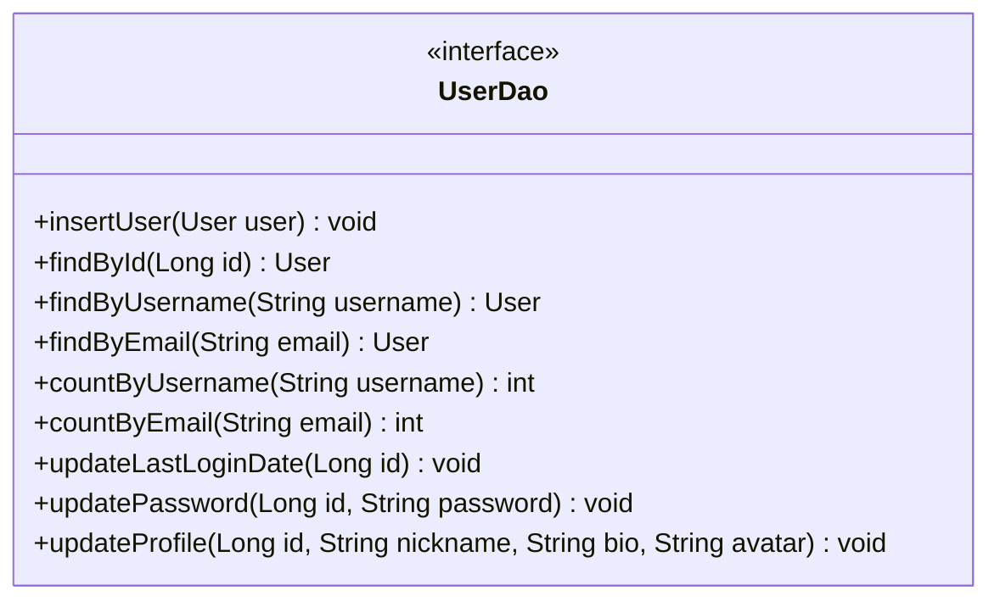
```mermaid
classDiagram
    class UserDao {
        <<interface>>
        +insertUser(User user) void
        +findById(Long id) User
        +findByUsername(String username) User
        +findByEmail(String email) User
        +countByUsername(String username) int
        +countByEmail(String email) int
        +updateLastLoginDate(Long id) void
        +updatePassword(Long id, String password) void
        +updateProfile(Long id, String nickname, String bio, String avatar) void
    }
```

**메서드 설명**:
- `insertUser`: 새로운 사용자 등록
- `findById`: ID로 사용자 조회
- `findByUsername`: 아이디로 사용자 조회
- `findByEmail`: 이메일로 사용자 조회
- `countByUsername`: 아이디 중복 체크
- `countByEmail`: 이메일 중복 체크
- `updateLastLoginDate`: 마지막 로그인 시간 업데이트
- `updatePassword`: 비밀번호 변경
- `updateProfile`: 프로필 정보 업데이트

---

### 3.2 PostDao

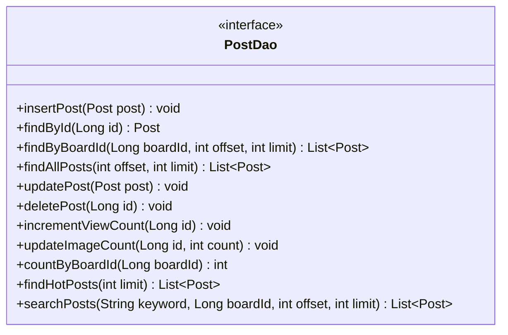
```mermaid
classDiagram
    class PostDao {
        <<interface>>
        +insertPost(Post post) void
        +findById(Long id) Post
        +findByBoardId(Long boardId, int offset, int limit) List~Post~
        +findAllPosts(int offset, int limit) List~Post~
        +updatePost(Post post) void
        +deletePost(Long id) void
        +incrementViewCount(Long id) void
        +updateImageCount(Long id, int count) void
        +countByBoardId(Long boardId) int
        +findHotPosts(int limit) List~Post~
        +searchPosts(String keyword, Long boardId, int offset, int limit) List~Post~
    }
```

**메서드 설명**:
- `insertPost`: 새 게시글 작성
- `findById`: ID로 게시글 조회
- `findByBoardId`: 게시판별 게시글 목록 조회 (페이징)
- `findAllPosts`: 전체 게시글 목록 조회 (페이징)
- `updatePost`: 게시글 수정
- `deletePost`: 게시글 삭제
- `incrementViewCount`: 조회수 증가
- `updateImageCount`: 이미지 개수 업데이트
- `countByBoardId`: 게시판별 게시글 수
- `findHotPosts`: 인기 게시글 조회
- `searchPosts`: 게시글 검색

---

### 3.3 PostImageDao

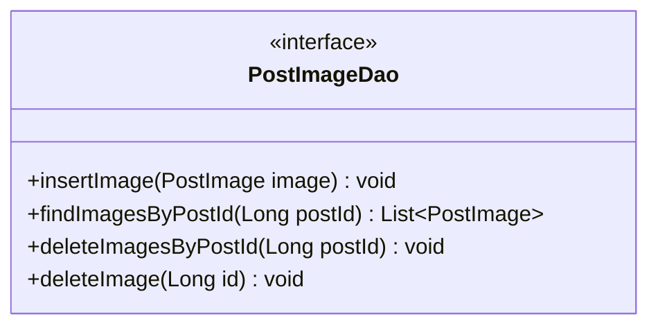
```mermaid
classDiagram
    class PostImageDao {
        <<interface>>
        +insertImage(PostImage image) void
        +findImagesByPostId(Long postId) List~PostImage~
        +deleteImagesByPostId(Long postId) void
        +deleteImage(Long id) void
    }
```

**메서드 설명**:
- `insertImage`: 이미지 정보 저장
- `findImagesByPostId`: 게시글의 이미지 목록 조회
- `deleteImagesByPostId`: 게시글의 모든 이미지 삭제
- `deleteImage`: 특정 이미지 삭제

---

### 3.4 PostLikeDao

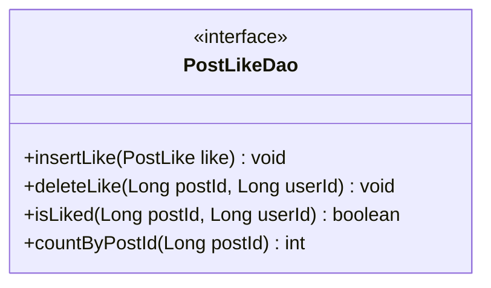
```mermaid
classDiagram
    class PostLikeDao {
        <<interface>>
        +insertLike(PostLike like) void
        +deleteLike(Long postId, Long userId) void
        +isLiked(Long postId, Long userId) boolean
        +countByPostId(Long postId) int
    }
```

**메서드 설명**:
- `insertLike`: 좋아요 추가
- `deleteLike`: 좋아요 취소
- `isLiked`: 좋아요 여부 확인
- `countByPostId`: 게시글의 좋아요 수

---

### 3.5 CommentDao

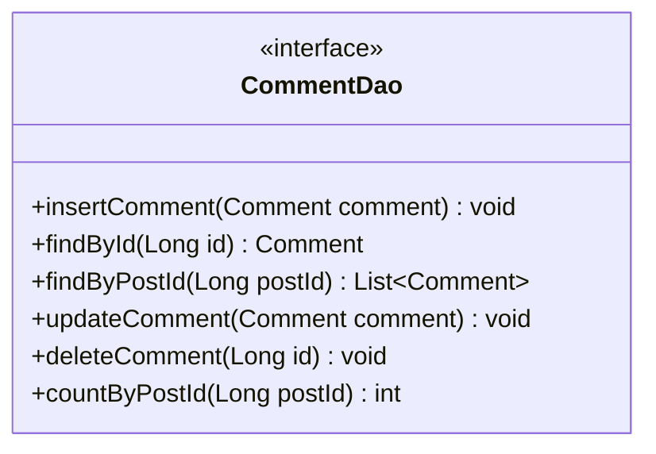
```mermaid
classDiagram
    class CommentDao {
        <<interface>>
        +insertComment(Comment comment) void
        +findById(Long id) Comment
        +findByPostId(Long postId) List~Comment~
        +updateComment(Comment comment) void
        +deleteComment(Long id) void
        +countByPostId(Long postId) int
    }
```

**메서드 설명**:
- `insertComment`: 댓글 작성
- `findById`: ID로 댓글 조회
- `findByPostId`: 게시글의 댓글 목록 조회
- `updateComment`: 댓글 수정
- `deleteComment`: 댓글 삭제
- `countByPostId`: 게시글의 댓글 수

---

### 3.6 MessageDao

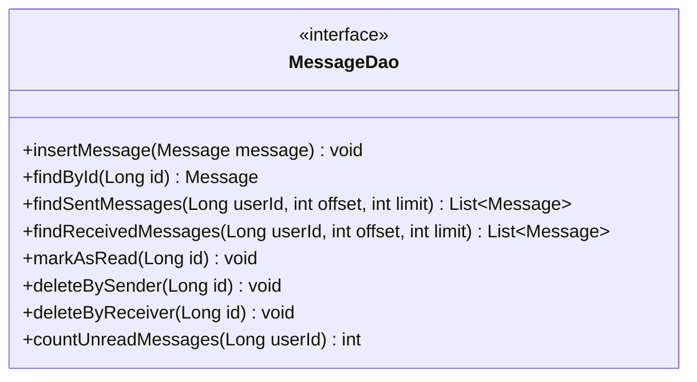
```mermaid
classDiagram
    class MessageDao {
        <<interface>>
        +insertMessage(Message message) void
        +findById(Long id) Message
        +findSentMessages(Long userId, int offset, int limit) List~Message~
        +findReceivedMessages(Long userId, int offset, int limit) List~Message~
        +markAsRead(Long id) void
        +deleteBySender(Long id) void
        +deleteByReceiver(Long id) void
        +countUnreadMessages(Long userId) int
    }
```

**메서드 설명**:
- `insertMessage`: 쪽지 전송
- `findById`: ID로 쪽지 조회
- `findSentMessages`: 보낸 쪽지 목록 조회
- `findReceivedMessages`: 받은 쪽지 목록 조회
- `markAsRead`: 읽음 처리
- `deleteBySender`: 발신자가 삭제
- `deleteByReceiver`: 수신자가 삭제
- `countUnreadMessages`: 읽지 않은 쪽지 수

---

### 3.7 NotificationDao

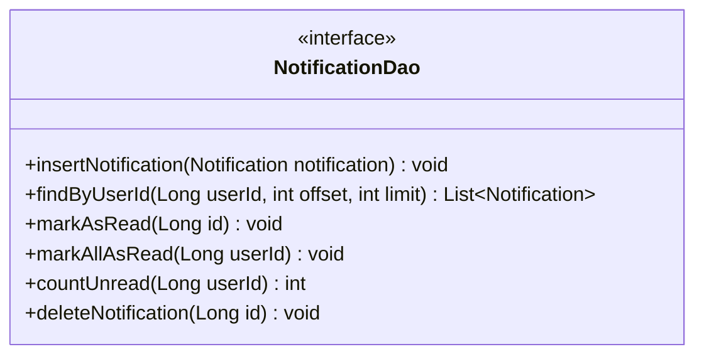
```mermaid
classDiagram
    class NotificationDao {
        <<interface>>
        +insertNotification(Notification notification) void
        +findByUserId(Long userId, int offset, int limit) List~Notification~
        +markAsRead(Long id) void
        +markAllAsRead(Long userId) void
        +countUnread(Long userId) int
        +deleteNotification(Long id) void
    }
```

**메서드 설명**:
- `insertNotification`: 알림 생성
- `findByUserId`: 사용자의 알림 목록 조회
- `markAsRead`: 알림 읽음 처리
- `markAllAsRead`: 모든 알림 읽음 처리
- `countUnread`: 읽지 않은 알림 수
- `deleteNotification`: 알림 삭제

---

### 3.8 ReportDao

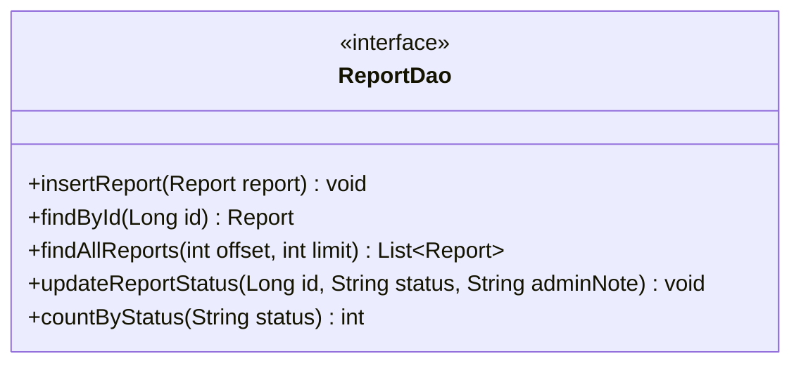
```mermaid
classDiagram
    class ReportDao {
        <<interface>>
        +insertReport(Report report) void
        +findById(Long id) Report
        +findAllReports(int offset, int limit) List~Report~
        +updateReportStatus(Long id, String status, String adminNote) void
        +countByStatus(String status) int
    }
```

**메서드 설명**:
- `insertReport`: 신고 접수
- `findById`: ID로 신고 조회
- `findAllReports`: 전체 신고 목록 조회
- `updateReportStatus`: 신고 처리 상태 업데이트
- `countByStatus`: 상태별 신고 수

---

### 3.9 TimetableDao

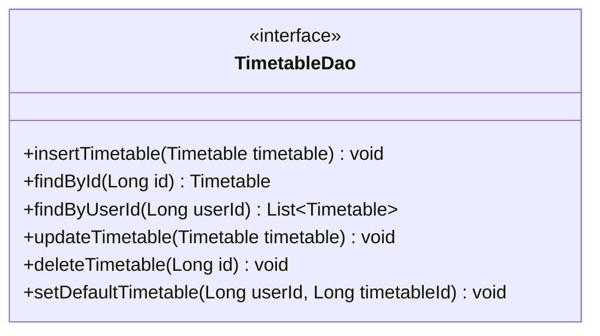
```mermaid
classDiagram
    class TimetableDao {
        <<interface>>
        +insertTimetable(Timetable timetable) void
        +findById(Long id) Timetable
        +findByUserId(Long userId) List~Timetable~
        +updateTimetable(Timetable timetable) void
        +deleteTimetable(Long id) void
        +setDefaultTimetable(Long userId, Long timetableId) void
    }
```

---

### 3.10 CourseDao

```mermaid
classDiagram
    class CourseDao {
        <<interface>>
        +insertCourse(Course course) void
        +findById(Long id) Course
        +findByTimetableId(Long timetableId) List~Course~
        +updateCourse(Course course) void
        +deleteCourse(Long id) void
    }
```

---

### 3.11 LectureReviewDao

```mermaid
classDiagram
    class LectureReviewDao {
        <<interface>>
        +insertReview(LectureReview review) void
        +findById(Long id) LectureReview
        +findByCourseName(String courseName, int offset, int limit) List~LectureReview~
        +findByProfessor(String professor, int offset, int limit) List~LectureReview~
        +updateReview(LectureReview review) void
        +deleteReview(Long id) void
        +getAverageRatings(String courseName, String professor) Map~String, Double~
    }
```

---

### 3.12 ChatMessageDao

```mermaid
classDiagram
    class ChatMessageDao {
        <<interface>>
        +insertMessage(ChatMessage message) void
        +findRecentMessages(int limit) List~ChatMessage~
    }
```

---

## 4. 서비스 계층 (Service Layer)

### 4.1 AuthService

```mermaid
classDiagram
    class AuthService {
        -UserDao userDao
        -BCryptPasswordEncoder passwordEncoder

        +register(RegisterRequest request) RegisterResponse
        +login(LoginRequest request) LoginResponse
        +findUsernameByEmail(String email) String
        +verifyEmailAndUsername(String email, String username) boolean
        +resetPassword(String email, String username, String newPassword) boolean
        -isValidEmail(String email) boolean
    }
```

**주요 메서드**:
- `register`: 회원가입 (유효성 검증, 중복 체크, BCrypt 암호화)
- `login`: 로그인 (인증, 세션 생성)
- `findUsernameByEmail`: 이메일로 아이디 찾기
- `verifyEmailAndUsername`: 이메일과 아이디 일치 여부 확인
- `resetPassword`: 비밀번호 재설정
- `isValidEmail`: 이메일 형식 검증 (정규표현식)

**비즈니스 로직**:
- 아이디: 4-20자 길이 검증
- 비밀번호: 최소 8자 검증, BCrypt 암호화
- 이메일: 정규표현식 검증, 중복 체크
- 닉네임: 필수 입력 검증
- 계정 상태: ACTIVE 기본값

---

### 4.2 EmailVerificationService

```mermaid
classDiagram
    class EmailVerificationService {
        -Map~String, VerificationCode~ verificationCodes
        -int CODE_LENGTH = 6
        -long CODE_EXPIRY_MS = 300000

        +generateVerificationCode(String email) String
        +verifyCode(String email, String code) boolean
        -generateRandomCode() String
    }

    class VerificationCode {
        <<inner class>>
        +String code
        +long expiryTime

        +VerificationCode(String code, long expiryTime)
    }

    EmailVerificationService --> VerificationCode : uses
```

**주요 메서드**:
- `generateVerificationCode`: 6자리 인증 코드 생성 및 저장 (5분 유효)
- `verifyCode`: 인증 코드 검증 (만료 시간 체크, 일치 여부 확인)
- `generateRandomCode`: 랜덤 6자리 숫자 생성

**비즈니스 로직**:
- 인증 코드: 6자리 랜덤 숫자
- 유효 시간: 5분 (300,000ms)
- 저장소: ConcurrentHashMap (개발 환경, 추후 Redis로 교체 권장)
- 검증 후 코드 자동 삭제
- 개발 환경에서 콘솔에 코드 출력

---

### 4.3 PostService

```mermaid
classDiagram
    class PostService {
        -PostDao postDao
        -PostImageDao postImageDao
        -PostLikeDao postLikeDao
        -UserDao userDao
        -NotificationService notificationService

        +createPost(CreatePostRequest request, Long userId) PostResponse
        +getPostById(Long id) Post
        +getPostsByBoardId(Long boardId, int page, int pageSize) List~Post~
        +updatePost(Long id, UpdatePostRequest request, Long userId) PostResponse
        +deletePost(Long id, Long userId) PostResponse
        +toggleLike(Long postId, Long userId) boolean
        +isLiked(Long postId, Long userId) boolean
        +searchPosts(String keyword, Long boardId, int page, int pageSize) List~Post~
    }
```

**주요 메서드**:
- `createPost`: 게시글 작성 (이미지 업로드 포함)
- `getPostById`: 게시글 상세 조회 (조회수 증가, 이미지 포함)
- `getPostsByBoardId`: 게시판별 게시글 목록 (페이징)
- `updatePost`: 게시글 수정 (작성자 검증)
- `deletePost`: 게시글 삭제 (작성자 검증)
- `toggleLike`: 좋아요 토글
- `isLiked`: 좋아요 여부 확인
- `searchPosts`: 게시글 검색

**비즈니스 로직**:
- 게시글 작성 시 이미지 자동 연결
- 조회 시 조회수 자동 증가
- 좋아요 시 알림 자동 생성
- 작성자만 수정/삭제 가능
- 트랜잭션 관리

---

### 4.4 CommentService

```mermaid
classDiagram
    class CommentService {
        -CommentDao commentDao
        -PostDao postDao
        -UserDao userDao
        -NotificationService notificationService

        +createComment(CreateCommentRequest request, Long userId) CommentResponse
        +getCommentsByPostId(Long postId) List~Comment~
        +updateComment(Long id, UpdateCommentRequest request, Long userId) CommentResponse
        +deleteComment(Long id, Long userId) CommentResponse
    }
```

**주요 메서드**:
- `createComment`: 댓글 작성 (일반 댓글, 대댓글)
- `getCommentsByPostId`: 게시글의 댓글 목록 조회
- `updateComment`: 댓글 수정 (작성자 검증)
- `deleteComment`: 댓글 삭제 (작성자 검증)

**비즈니스 로직**:
- 댓글 작성 시 게시글 작성자에게 알림
- 대댓글 작성 시 부모 댓글 작성자에게 알림
- 트랜잭션 관리
- 작성자만 수정/삭제 가능

---

### 4.5 MessageService

```mermaid
classDiagram
    class MessageService {
        -MessageDao messageDao
        -UserDao userDao

        +sendMessage(Long senderId, Long receiverId, String title, String content) boolean
        +getSentMessages(Long userId, int page, int pageSize) List~Message~
        +getReceivedMessages(Long userId, int page, int pageSize) List~Message~
        +markAsRead(Long messageId, Long userId) boolean
        +deleteBySender(Long messageId, Long userId) boolean
        +deleteByReceiver(Long messageId, Long userId) boolean
        +getUnreadCount(Long userId) int
    }
```

**주요 메서드**:
- `sendMessage`: 쪽지 전송
- `getSentMessages`: 보낸 쪽지함 조회
- `getReceivedMessages`: 받은 쪽지함 조회
- `markAsRead`: 읽음 처리
- `deleteBySender`: 발신자가 삭제
- `deleteByReceiver`: 수신자가 삭제
- `getUnreadCount`: 읽지 않은 쪽지 수

**비즈니스 로직**:
- 양방향 soft delete (발신자/수신자 각각 삭제 플래그)
- 읽음 처리는 수신자만 가능
- 페이징 지원

---

### 4.6 NotificationService

```mermaid
classDiagram
    class NotificationService {
        -NotificationDao notificationDao

        +createNotification(Long userId, String type, Long relatedId, Long actorId, String actorName, String message) void
        +getNotifications(Long userId, int page, int pageSize) List~Notification~
        +markAsRead(Long notificationId, Long userId) boolean
        +markAllAsRead(Long userId) void
        +getUnreadCount(Long userId) int
        +deleteNotification(Long notificationId, Long userId) boolean
    }
```

**주요 메서드**:
- `createNotification`: 알림 생성
- `getNotifications`: 알림 목록 조회
- `markAsRead`: 알림 읽음 처리
- `markAllAsRead`: 모든 알림 읽음 처리
- `getUnreadCount`: 읽지 않은 알림 수
- `deleteNotification`: 알림 삭제

**비즈니스 로직**:
- 알림 유형: COMMENT, LIKE, REPLY
- 자동 알림 생성 (댓글, 좋아요, 대댓글)
- 실시간 알림 카운트

---

### 4.7 FileUploadService

```mermaid
classDiagram
    class FileUploadService {
        -String uploadDirectory

        +uploadFile(MultipartFile file) String
        +deleteFile(String filename) boolean
        -generateUniqueFilename(String originalFilename) String
        -isValidImageFile(MultipartFile file) boolean
    }
```

**주요 메서드**:
- `uploadFile`: 파일 업로드 (이미지 검증, 고유 파일명 생성)
- `deleteFile`: 파일 삭제
- `generateUniqueFilename`: UUID 기반 고유 파일명 생성
- `isValidImageFile`: 이미지 파일 검증

**비즈니스 로직**:
- 지원 형식: JPG, JPEG, PNG, GIF
- 최대 파일 크기: 5MB
- 파일명: UUID + 원본 확장자
- 저장 경로: /Users/yunsu-in/Downloads/Globalin/uploads

---

### 4.8 AdminService

```mermaid
classDiagram
    class AdminService {
        -UserDao userDao
        -PostDao postDao
        -ReportDao reportDao

        +getAllUsers(int page, int pageSize) List~User~
        +banUser(Long userId, String reason) boolean
        +unbanUser(Long userId) boolean
        +deletePost(Long postId) boolean
        +getPendingReports(int page, int pageSize) List~Report~
        +resolveReport(Long reportId, String status, String adminNote) boolean
    }
```

**주요 메서드**:
- `getAllUsers`: 전체 사용자 목록 조회
- `banUser`: 사용자 정지
- `unbanUser`: 정지 해제
- `deletePost`: 게시글 강제 삭제
- `getPendingReports`: 처리 대기 신고 목록
- `resolveReport`: 신고 처리

---

## 5. 컨트롤러 계층 (Controller Layer)

### 5.1 AuthController

```mermaid
classDiagram
    class AuthController {
        -AuthService authService
        -EmailVerificationService emailVerificationService

        +register(RegisterRequest request) ResponseEntity~RegisterResponse~
        +login(LoginRequest request, HttpSession session) ResponseEntity~LoginResponse~
        +logout(HttpSession session) ResponseEntity
        +checkSession(HttpSession session) ResponseEntity
        +findUsername(Map~String,String~ request) ResponseEntity
        +sendVerificationCode(Map~String,String~ request) ResponseEntity
        +resetPassword(Map~String,String~ request) ResponseEntity
    }
```

**엔드포인트**:
- `POST /api/auth/register`: 회원가입
- `POST /api/auth/login`: 로그인
- `POST /api/auth/logout`: 로그아웃
- `GET /api/auth/check`: 세션 확인
- `POST /api/auth/find-username`: 아이디 찾기
- `POST /api/auth/send-verification-code`: 인증 코드 전송
- `POST /api/auth/reset-password`: 비밀번호 재설정

**세션 관리**:
- 로그인 시 세션에 저장: userId, username, nickname
- 로그아웃 시 세션 무효화
- 세션 확인으로 로그인 상태 체크

---

### 5.2 PostController

```mermaid
classDiagram
    class PostController {
        -PostService postService

        +createPost(CreatePostRequest request, HttpSession session) ResponseEntity~PostResponse~
        +getPost(Long id, HttpSession session) ResponseEntity
        +getPostsByBoard(Long boardId, int page, int size) ResponseEntity
        +updatePost(Long id, UpdatePostRequest request, HttpSession session) ResponseEntity
        +deletePost(Long id, HttpSession session) ResponseEntity
        +toggleLike(Long id, HttpSession session) ResponseEntity
        +searchPosts(String keyword, Long boardId, int page, int size) ResponseEntity
    }
```

**엔드포인트**:
- `POST /api/posts`: 게시글 작성
- `GET /api/posts/{id}`: 게시글 상세 조회
- `GET /api/posts/board/{boardId}`: 게시판별 게시글 목록
- `PUT /api/posts/{id}`: 게시글 수정
- `DELETE /api/posts/{id}`: 게시글 삭제
- `POST /api/posts/{id}/like`: 좋아요 토글
- `GET /api/posts/search`: 게시글 검색

---

### 5.3 CommentController

```mermaid
classDiagram
    class CommentController {
        -CommentService commentService

        +createComment(CreateCommentRequest request, HttpSession session) ResponseEntity~CommentResponse~
        +getComments(Long postId) ResponseEntity
        +updateComment(Long id, UpdateCommentRequest request, HttpSession session) ResponseEntity
        +deleteComment(Long id, HttpSession session) ResponseEntity
    }
```

**엔드포인트**:
- `POST /api/comments`: 댓글 작성
- `GET /api/comments/post/{postId}`: 게시글의 댓글 목록
- `PUT /api/comments/{id}`: 댓글 수정
- `DELETE /api/comments/{id}`: 댓글 삭제

---

### 5.4 MessageController

```mermaid
classDiagram
    class MessageController {
        -MessageService messageService

        +sendMessage(Map~String,Object~ request, HttpSession session) ResponseEntity
        +getSentMessages(int page, int size, HttpSession session) ResponseEntity
        +getReceivedMessages(int page, int size, HttpSession session) ResponseEntity
        +markAsRead(Long id, HttpSession session) ResponseEntity
        +deleteSentMessage(Long id, HttpSession session) ResponseEntity
        +deleteReceivedMessage(Long id, HttpSession session) ResponseEntity
        +getUnreadCount(HttpSession session) ResponseEntity
    }
```

**엔드포인트**:
- `POST /api/messages`: 쪽지 전송
- `GET /api/messages/sent`: 보낸 쪽지함
- `GET /api/messages/received`: 받은 쪽지함
- `PUT /api/messages/{id}/read`: 읽음 처리
- `DELETE /api/messages/sent/{id}`: 보낸 쪽지 삭제
- `DELETE /api/messages/received/{id}`: 받은 쪽지 삭제
- `GET /api/messages/unread/count`: 읽지 않은 쪽지 수

---

### 5.5 NotificationController

```mermaid
classDiagram
    class NotificationController {
        -NotificationService notificationService

        +getNotifications(int page, int size, HttpSession session) ResponseEntity
        +markAsRead(Long id, HttpSession session) ResponseEntity
        +markAllAsRead(HttpSession session) ResponseEntity
        +getUnreadCount(HttpSession session) ResponseEntity
        +deleteNotification(Long id, HttpSession session) ResponseEntity
    }
```

**엔드포인트**:
- `GET /api/notifications`: 알림 목록
- `PUT /api/notifications/{id}/read`: 알림 읽음 처리
- `PUT /api/notifications/read-all`: 모든 알림 읽음 처리
- `GET /api/notifications/unread/count`: 읽지 않은 알림 수
- `DELETE /api/notifications/{id}`: 알림 삭제

---

### 5.6 ImageUploadController

```mermaid
classDiagram
    class ImageUploadController {
        -FileUploadService fileUploadService

        +uploadImage(MultipartFile file, HttpSession session) ResponseEntity
        +deleteImage(String filename, HttpSession session) ResponseEntity
    }
```

**엔드포인트**:
- `POST /api/upload/image`: 이미지 업로드
- `DELETE /api/upload/image`: 이미지 삭제

---

### 5.7 AdminController

```mermaid
classDiagram
    class AdminController {
        -AdminService adminService

        +getAllUsers(int page, int size, HttpSession session) ResponseEntity
        +banUser(Long userId, Map~String,String~ request, HttpSession session) ResponseEntity
        +unbanUser(Long userId, HttpSession session) ResponseEntity
        +deletePost(Long postId, HttpSession session) ResponseEntity
        +getPendingReports(int page, int size, HttpSession session) ResponseEntity
        +resolveReport(Long reportId, Map~String,String~ request, HttpSession session) ResponseEntity
    }
```

**엔드포인트**:
- `GET /api/admin/users`: 전체 사용자 목록
- `POST /api/admin/users/{userId}/ban`: 사용자 정지
- `POST /api/admin/users/{userId}/unban`: 정지 해제
- `DELETE /api/admin/posts/{postId}`: 게시글 강제 삭제
- `GET /api/admin/reports`: 처리 대기 신고 목록
- `PUT /api/admin/reports/{reportId}`: 신고 처리

---

## 6. DTO 계층 (Data Transfer Object)

### 6.1 Request DTOs

```mermaid
classDiagram
    class RegisterRequest {
        -String username
        -String password
        -String email
        -String nickname

        +getters and setters
    }

    class LoginRequest {
        -String username
        -String password

        +getters and setters
    }

    class CreatePostRequest {
        -Long boardId
        -String title
        -String content
        -Boolean isAnonymous
        -List~String~ imageUrls

        +getters and setters
    }

    class UpdatePostRequest {
        -String title
        -String content

        +getters and setters
    }

    class CreateCommentRequest {
        -Long postId
        -Long parentId
        -String content
        -Boolean isAnonymous

        +getters and setters
    }

    class UpdateCommentRequest {
        -String content

        +getters and setters
    }
```

---

### 6.2 Response DTOs

```mermaid
classDiagram
    class RegisterResponse {
        -boolean success
        -String message
        -Long userId

        +RegisterResponse(boolean success, String message)
        +RegisterResponse(boolean success, String message, Long userId)
        +getters and setters
    }

    class LoginResponse {
        -boolean success
        -String message
        -Long userId
        -String username
        -String nickname

        +LoginResponse(boolean success, String message)
        +getters and setters
    }

    class PostResponse {
        -boolean success
        -String message
        -Long postId

        +PostResponse(boolean success, String message)
        +PostResponse(boolean success, String message, Long postId)
        +getters and setters
    }

    class CommentResponse {
        -boolean success
        -String message
        -Long commentId

        +CommentResponse(boolean success, String message)
        +CommentResponse(boolean success, String message, Long commentId)
        +getters and setters
    }
```

---

## 7. 설정 및 유틸리티

### 7.1 WebConfig

```mermaid
classDiagram
    class WebConfig {
        <<@Configuration>>
        -String uploadDirectory

        +addCorsMappings(CorsRegistry registry) void
        +addResourceHandlers(ResourceHandlerRegistry registry) void
        +multipartResolver() CommonsMultipartResolver
    }
```

**설정 내용**:
- **CORS**: `http://localhost:3000` 허용, credentials 포함
- **Static Resources**: `/uploads/**` → 파일 시스템 매핑
- **Multipart**: 최대 파일 크기 5MB

---

### 7.2 WebSocketConfig

```mermaid
classDiagram
    class WebSocketConfig {
        <<@Configuration>>

        +registerStompEndpoints(StompEndpointRegistry registry) void
        +configureMessageBroker(MessageBrokerRegistry registry) void
    }
```

**설정 내용**:
- **STOMP Endpoint**: `/ws-chat`
- **Message Broker**: `/topic` (구독), `/app` (메시지 전송)
- **CORS**: 모든 origin 허용

---

## 8. 데이터베이스 ERD

```mermaid
erDiagram
    users ||--o{ posts : writes
    users ||--o{ comments : writes
    users ||--o{ post_likes : likes
    users ||--o{ messages_sender : sends
    users ||--o{ messages_receiver : receives
    users ||--o{ notifications : receives
    users ||--o{ reports_reporter : reports
    users ||--o{ timetables : owns
    users ||--o{ lecture_reviews : writes

    boards ||--o{ posts : contains

    posts ||--o{ comments : has
    posts ||--o{ post_likes : has
    posts ||--o{ post_images : has
    posts ||--o{ reports : reported_in

    comments ||--o{ comments : replies

    timetables ||--o{ courses : contains

    users {
        BIGINT id PK
        VARCHAR username UK
        VARCHAR password
        VARCHAR email UK
        VARCHAR nickname
        VARCHAR avatar
        TEXT bio
        TIMESTAMP join_date
        TIMESTAMP last_login_date
        VARCHAR status
        VARCHAR role
    }

    boards {
        BIGINT id PK
        VARCHAR name
        TEXT description
        INT post_count
        VARCHAR category
        VARCHAR icon
    }

    posts {
        BIGINT id PK
        BIGINT board_id FK
        BIGINT author_id FK
        VARCHAR title
        TEXT content
        INT view_count
        INT comment_count
        INT like_count
        BOOLEAN is_anonymous
        INT image_count
        TIMESTAMP created_at
        TIMESTAMP updated_at
    }

    post_images {
        BIGINT id PK
        BIGINT post_id FK
        VARCHAR image_url
        VARCHAR original_filename
        BIGINT file_size
        INT display_order
        TIMESTAMP created_at
    }

    comments {
        BIGINT id PK
        BIGINT post_id FK
        BIGINT author_id FK
        BIGINT parent_id FK
        TEXT content
        BOOLEAN is_anonymous
        VARCHAR status
        INT like_count
        TIMESTAMP created_at
        TIMESTAMP updated_at
    }

    post_likes {
        BIGINT id PK
        BIGINT post_id FK
        BIGINT user_id FK
        TIMESTAMP created_at
    }

    messages {
        BIGINT id PK
        BIGINT sender_id FK
        BIGINT receiver_id FK
        VARCHAR title
        TEXT content
        BOOLEAN is_read
        BOOLEAN deleted_by_sender
        BOOLEAN deleted_by_receiver
        TIMESTAMP created_at
    }

    notifications {
        BIGINT id PK
        BIGINT user_id FK
        VARCHAR type
        BIGINT related_id
        BIGINT actor_id FK
        VARCHAR actor_name
        TEXT message
        BOOLEAN is_read
        TIMESTAMP created_at
    }

    reports {
        BIGINT id PK
        BIGINT reporter_id FK
        BIGINT post_id FK
        BIGINT user_id FK
        TEXT reason
        VARCHAR status
        TEXT admin_note
        TIMESTAMP created_at
        TIMESTAMP resolved_at
    }

    timetables {
        BIGINT id PK
        BIGINT user_id FK
        VARCHAR semester
        INT year
        VARCHAR name
        BOOLEAN is_default
        TIMESTAMP created_at
        TIMESTAMP updated_at
    }

    courses {
        BIGINT id PK
        BIGINT timetable_id FK
        VARCHAR course_name
        VARCHAR professor
        VARCHAR location
        INT day_of_week
        TIME start_time
        TIME end_time
        VARCHAR color
        DECIMAL credits
        TEXT memo
        TIMESTAMP created_at
        TIMESTAMP updated_at
    }

    lecture_reviews {
        BIGINT id PK
        BIGINT user_id FK
        VARCHAR course_name
        VARCHAR professor
        INT difficulty
        INT workload
        INT satisfaction
        TEXT review_text
        VARCHAR semester
        INT year
        BOOLEAN is_anonymous
        TIMESTAMP created_at
        TIMESTAMP updated_at
    }

    chat_messages {
        BIGINT id PK
        VARCHAR username
        TEXT message
        TIMESTAMP created_at
    }
```

---

## 주요 디자인 패턴

### 1. Layered Architecture (계층형 아키텍처)
- **Controller Layer**: HTTP 요청/응답 처리
- **Service Layer**: 비즈니스 로직
- **DAO Layer**: 데이터 접근
- **Model Layer**: 도메인 엔티티

### 2. DAO Pattern
- 데이터베이스 접근 로직을 DAO 인터페이스로 추상화
- MyBatis Mapper XML과 연동

### 3. DTO Pattern
- 계층 간 데이터 전송을 위한 별도 객체
- Request/Response 분리

### 4. Service Layer Pattern
- 비즈니스 로직을 Service 계층에 캡슐화
- `@Transactional`로 트랜잭션 관리

### 5. Dependency Injection
- Spring의 `@Autowired`를 사용한 의존성 주입
- 느슨한 결합, 테스트 용이성

### 6. Builder Pattern
- DTO 생성 시 생성자 오버로딩 활용

---

## 보안 구현

### 1. 비밀번호 암호화
- **BCryptPasswordEncoder** 사용
- 단방향 해시, Salt 자동 생성

### 2. 세션 기반 인증
- HttpSession을 통한 사용자 인증
- 세션에 userId, username, nickname 저장

### 3. 권한 검증
- 게시글/댓글 수정/삭제 시 작성자 검증
- 관리자 기능은 role 검증

### 4. SQL Injection 방지
- MyBatis의 `#{}` 파라미터 바인딩 사용

### 5. XSS 방지
- 프론트엔드에서 입력 검증
- 필요 시 HTML 이스케이프

### 6. CSRF
- Spring Security CSRF 토큰 (추후 적용 권장)

---

## 기술 스택

### Backend
- **Framework**: Spring Framework 5.3.31
- **Language**: Java 8
- **Build Tool**: Maven
- **ORM**: MyBatis 3.5.13
- **Database**: MariaDB
- **Password Encryption**: BCrypt
- **Session**: HttpSession
- **File Upload**: Commons FileUpload

### Frontend
- **Framework**: React 18.3.1
- **Language**: TypeScript
- **Styling**: SCSS
- **Routing**: React Router
- **HTTP Client**: Fetch API

### DevOps
- **Server**: Tomcat 7
- **Database User**: globalin_user
- **Database Password**: globalin_pass
- **Upload Directory**: /Users/yunsu-in/Downloads/Globalin/uploads

---

## 파일 업로드 흐름

```mermaid
sequenceDiagram
    participant Client
    participant ImageUploadController
    participant FileUploadService
    participant FileSystem
    participant PostController
    participant PostService
    participant PostImageDao
    participant Database

    Client->>ImageUploadController: POST /api/upload/image
    ImageUploadController->>FileUploadService: uploadFile(file)
    FileUploadService->>FileUploadService: validateImage()
    FileUploadService->>FileUploadService: generateUniqueFilename()
    FileUploadService->>FileSystem: save file
    FileSystem-->>FileUploadService: success
    FileUploadService-->>ImageUploadController: imageUrl
    ImageUploadController-->>Client: {"imageUrl": "/uploads/..."}

    Client->>PostController: POST /api/posts (with imageUrls)
    PostController->>PostService: createPost(request)
    PostService->>Database: insert post
    Database-->>PostService: postId
    PostService->>PostImageDao: insertImage(postImage)
    PostImageDao->>Database: insert post_image
    Database-->>PostImageDao: success
    PostImageDao-->>PostService: success
    PostService-->>PostController: PostResponse
    PostController-->>Client: {"success": true, "postId": 123}
```

---

## 인증 및 비밀번호 재설정 흐름

```mermaid
sequenceDiagram
    participant Client
    participant AuthController
    participant EmailVerificationService
    participant AuthService
    participant UserDao
    participant Database

    Note over Client,Database: 비밀번호 재설정 흐름

    Client->>AuthController: POST /api/auth/send-verification-code
    AuthController->>AuthService: verifyEmailAndUsername(email, username)
    AuthService->>UserDao: findByEmail(email)
    UserDao->>Database: SELECT * FROM users WHERE email = ?
    Database-->>UserDao: user
    UserDao-->>AuthService: user
    AuthService->>AuthService: check username match
    AuthService-->>AuthController: true/false

    alt Email and Username Match
        AuthController->>EmailVerificationService: generateVerificationCode(email)
        EmailVerificationService->>EmailVerificationService: generate 6-digit code
        EmailVerificationService->>EmailVerificationService: store with 5min expiry
        EmailVerificationService->>EmailVerificationService: print to console
        EmailVerificationService-->>AuthController: code
        AuthController-->>Client: {"success": true, "message": "인증 코드 전송됨"}
    else No Match
        AuthController-->>Client: {"success": false, "message": "이메일과 아이디 불일치"}
    end

    Note over Client,Database: 인증 코드 검증 및 비밀번호 변경

    Client->>AuthController: POST /api/auth/reset-password
    AuthController->>EmailVerificationService: verifyCode(email, code)
    EmailVerificationService->>EmailVerificationService: check expiry
    EmailVerificationService->>EmailVerificationService: compare code
    EmailVerificationService-->>AuthController: true/false

    alt Code Valid
        AuthController->>AuthService: resetPassword(email, username, newPassword)
        AuthService->>UserDao: findByEmail(email)
        UserDao-->>AuthService: user
        AuthService->>AuthService: BCrypt encrypt password
        AuthService->>UserDao: updatePassword(userId, encryptedPassword)
        UserDao->>Database: UPDATE users SET password = ? WHERE id = ?
        Database-->>UserDao: success
        UserDao-->>AuthService: success
        AuthService-->>AuthController: true
        AuthController-->>Client: {"success": true, "message": "비밀번호 변경 성공"}
    else Code Invalid
        AuthController-->>Client: {"success": false, "message": "인증 코드 불일치"}
    end
```

---

## 알림 생성 흐름

```mermaid
sequenceDiagram
    participant Client
    participant CommentController
    participant CommentService
    participant NotificationService
    participant CommentDao
    participant PostDao
    participant NotificationDao
    participant Database

    Client->>CommentController: POST /api/comments
    CommentController->>CommentService: createComment(request, userId)
    CommentService->>CommentDao: insertComment(comment)
    CommentDao->>Database: INSERT INTO comments
    Database-->>CommentDao: commentId
    CommentDao-->>CommentService: comment

    alt Is Reply (parentId exists)
        CommentService->>CommentDao: findById(parentId)
        CommentDao->>Database: SELECT * FROM comments WHERE id = ?
        Database-->>CommentDao: parentComment
        CommentDao-->>CommentService: parentComment
        CommentService->>NotificationService: createNotification(parentComment.authorId, "REPLY", ...)
    else Is Comment (parentId null)
        CommentService->>PostDao: findById(postId)
        PostDao->>Database: SELECT * FROM posts WHERE id = ?
        Database-->>PostDao: post
        PostDao-->>CommentService: post
        CommentService->>NotificationService: createNotification(post.authorId, "COMMENT", ...)
    end

    NotificationService->>NotificationDao: insertNotification(notification)
    NotificationDao->>Database: INSERT INTO notifications
    Database-->>NotificationDao: success
    NotificationDao-->>NotificationService: success
    NotificationService-->>CommentService: success
    CommentService-->>CommentController: CommentResponse
    CommentController-->>Client: {"success": true, "commentId": 456}
```

---

## 마무리

이 문서는 Globalin 프로젝트의 **상세 클래스 다이어그램**입니다.

### 특징:
1. **모든 필드와 주요 메서드 포함**
2. **계층별 명확한 분리**
3. **ERD와 클래스 다이어그램 통합**
4. **시퀀스 다이어그램으로 주요 플로우 설명**
5. **디자인 패턴 및 보안 구현 설명**

### 활용:
- 신규 개발자 온보딩
- 시스템 아키텍처 이해
- 기능 확장 시 참고
- 코드 리뷰 및 리팩토링 가이드

---

**작성일**: 2025-12-21
**프로젝트**: Globalin 대학 커뮤니티 플랫폼
**기술 스택**: Spring 5.3.31 + MyBatis 3.5.13 + MariaDB + React 18.3.1 + TypeScript
