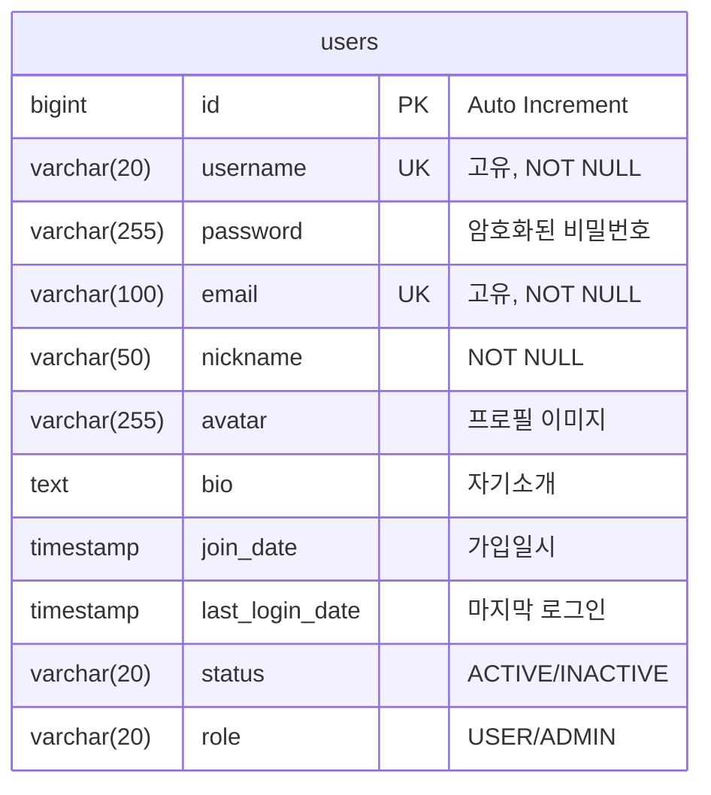
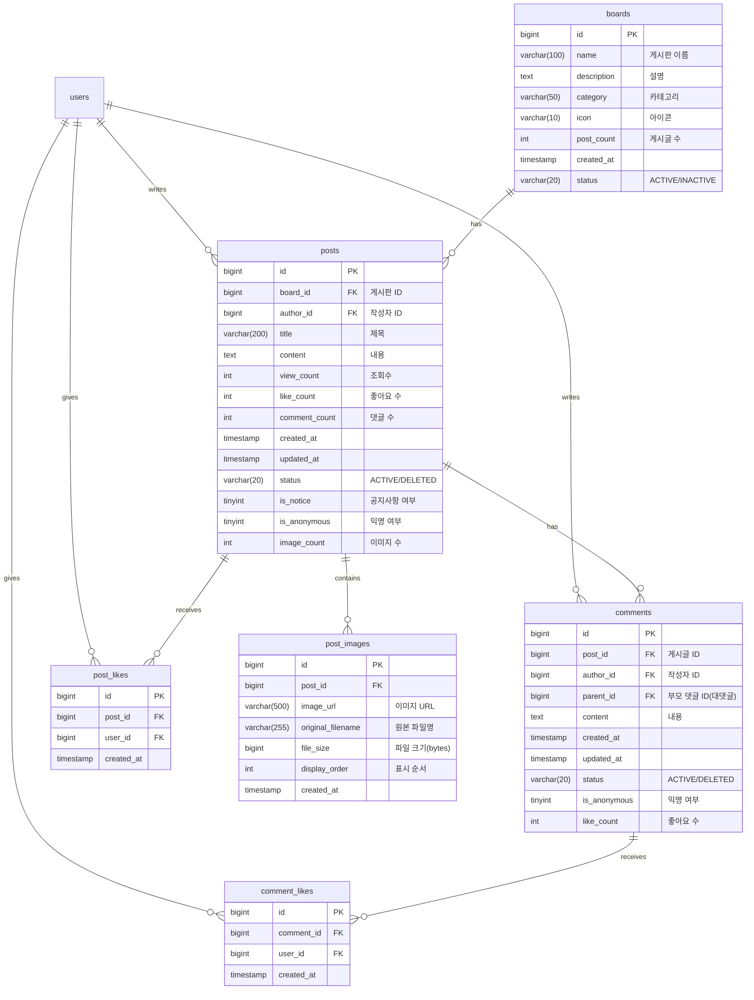
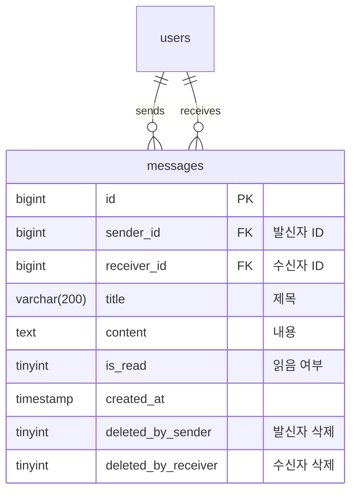
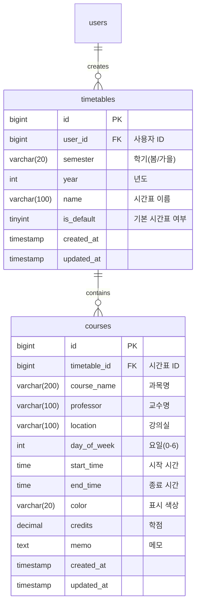
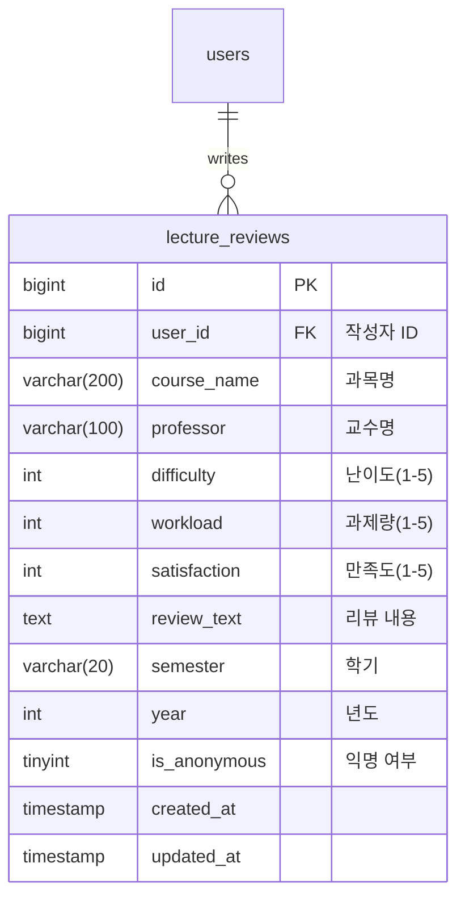
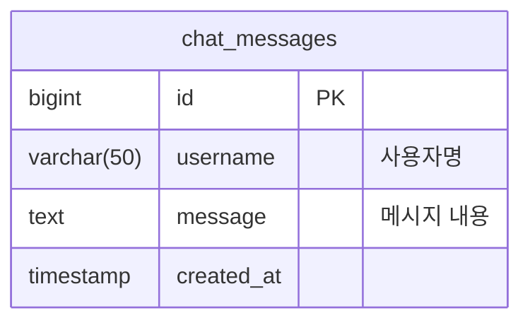
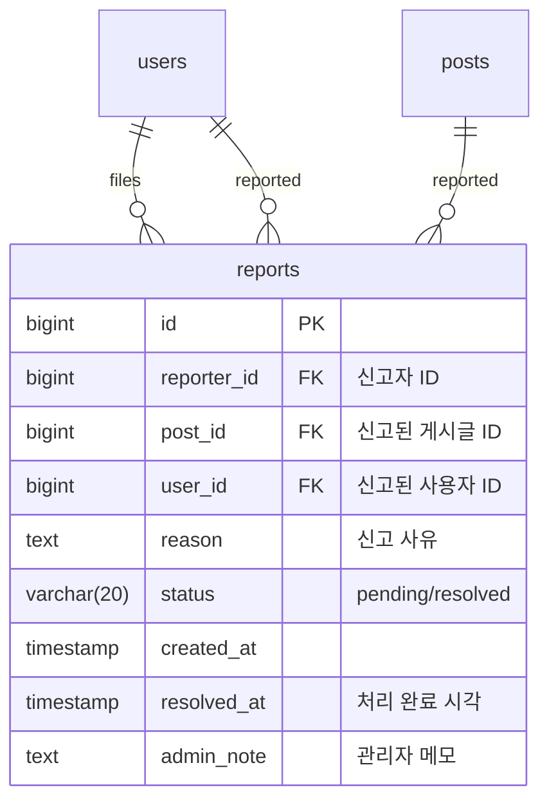
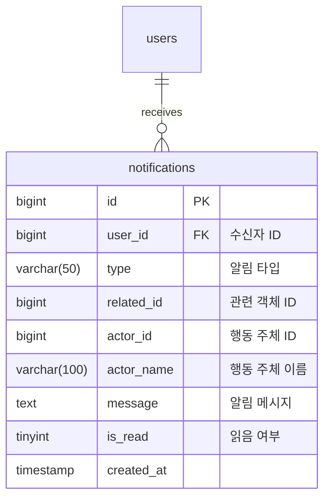
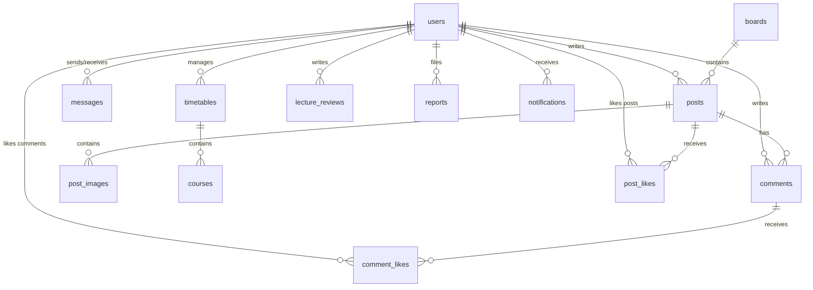

# Globalin ERD - 기능별 분류

## 목차
1. [사용자 관리 (User Management)](#1-사용자-관리)
2. [게시판 시스템 (Board System)](#2-게시판-시스템)
3. [쪽지 시스템 (Messaging System)](#3-쪽지-시스템)
4. [시간표 관리 (Timetable Management)](#4-시간표-관리)
5. [강의 평가 (Lecture Review)](#5-강의-평가)
6. [채팅 시스템 (Chat System)](#6-채팅-시스템)
7. [신고 시스템 (Report System)](#7-신고-시스템)
8. [알림 시스템 (Notification System)](#8-알림-시스템)

---

## 1. 사용자 관리 (User Management)



### 설명
- **핵심 기능**: 회원가입, 로그인, 프로필 관리
- **주요 필드**:
  - `username`: 4-20자 고유 아이디
  - `password`: BCrypt 암호화
  - `email`: 이메일 인증 및 아이디/비밀번호 찾기에 사용
  - `status`: 계정 활성화 상태 관리
  - `role`: 권한 관리 (일반 사용자/관리자)

---

## 2. 게시판 시스템 (Board System)



### 설명
- **핵심 기능**: 게시판별 게시글 작성/조회, 댓글, 좋아요, 이미지 업로드
- **주요 게시판**:
  - 중고장터, 자유게시판, 이벤트게시판
  - 동아리 홍보, 밥 모임, 스터디 모임 등
- **특징**:
  - 대댓글 지원 (`parent_id`)
  - 익명 게시 가능
  - 다중 이미지 업로드 지원
  - 공지사항 고정 기능

---

## 3. 쪽지 시스템 (Messaging System)



### 설명
- **핵심 기능**: 사용자 간 1:1 쪽지 전송
- **특징**:
  - 읽음 표시 기능
  - 양방향 삭제 (발신자/수신자 각각 삭제 가능)
  - 읽지 않은 메시지 카운트

---

## 4. 시간표 관리 (Timetable Management)



### 설명
- **핵심 기능**: 개인 시간표 작성 및 관리
- **특징**:
  - 학기별 시간표 생성
  - 과목별 시간/요일 설정
  - 색상으로 과목 구분
  - 메모 기능으로 추가 정보 입력

---

## 5. 강의 평가 (Lecture Review)



### 설명
- **핵심 기능**: 강의에 대한 평가 및 리뷰 작성
- **평가 지표**:
  - 난이도 (1-5)
  - 과제량 (1-5)
  - 만족도 (1-5)
- **특징**:
  - 익명 리뷰 가능
  - 과목명과 교수명으로 검색
  - 학기별 필터링

---

## 6. 채팅 시스템 (Chat System)



### 설명
- **핵심 기능**: 실시간 전체 채팅
- **특징**:
  - WebSocket 기반 실시간 통신
  - 전체 채팅방 (공개)
  - 메시지 히스토리 저장

---

## 7. 신고 시스템 (Report System)



### 설명
- **핵심 기능**: 게시글/사용자 신고 및 관리자 처리
- **신고 대상**:
  - 게시글 (`post_id`)
  - 사용자 (`user_id`)
- **처리 상태**:
  - pending: 대기중
  - resolved: 처리완료

---

## 8. 알림 시스템 (Notification System)



### 설명
- **핵심 기능**: 사용자 활동에 대한 실시간 알림
- **알림 타입**:
  - 댓글 알림
  - 좋아요 알림
  - 쪽지 알림
  - 답글 알림
- **특징**:
  - 읽지 않은 알림 카운트
  - 실시간 알림 배지 표시
  - 관련 페이지로 바로 이동

---

## 전체 관계도 요약



---

## 데이터베이스 통계

| 기능 영역 | 테이블 수 | 주요 관계 |
|---------|----------|---------|
| 사용자 관리 | 1 | 모든 테이블과 연결 |
| 게시판 시스템 | 6 | users, boards 중심 |
| 쪽지 시스템 | 1 | users 양방향 |
| 시간표 관리 | 2 | users → timetables → courses |
| 강의 평가 | 1 | users → lecture_reviews |
| 채팅 시스템 | 1 | 독립적 |
| 신고 시스템 | 1 | users, posts 참조 |
| 알림 시스템 | 1 | users → notifications |

**전체**: 14개 테이블

---

## 주요 인덱스 정보

### users
- PK: `id`
- UK: `username`, `email`

### posts
- PK: `id`
- FK: `board_id`, `author_id`
- IDX: `created_at`, `status`

### comments
- PK: `id`
- FK: `post_id`, `author_id`, `parent_id`

### timetables
- PK: `id`
- FK: `user_id`
- IDX: `semester`

### lecture_reviews
- PK: `id`
- FK: `user_id`
- IDX: `course_name`, `professor`

### notifications
- PK: `id`
- FK: `user_id`
- IDX: `is_read`, `created_at`

---

## 기능별 주요 쿼리 패턴

### 게시판 시스템
```sql
-- 게시판별 최신 게시글 조회
SELECT p.*, u.nickname, b.name as board_name
FROM posts p
JOIN users u ON p.author_id = u.id
JOIN boards b ON p.board_id = b.id
WHERE p.status = 'ACTIVE' AND b.id = ?
ORDER BY p.created_at DESC
LIMIT 20;
```

### 알림 시스템
```sql
-- 읽지 않은 알림 개수
SELECT COUNT(*)
FROM notifications
WHERE user_id = ? AND is_read = 0;
```

### 강의 평가
```sql
-- 과목별 평균 평가
SELECT
    course_name,
    professor,
    AVG(difficulty) as avg_difficulty,
    AVG(workload) as avg_workload,
    AVG(satisfaction) as avg_satisfaction,
    COUNT(*) as review_count
FROM lecture_reviews
WHERE course_name = ? AND professor = ?
GROUP BY course_name, professor;
```

---

## 보안 및 제약사항

### 데이터 무결성
- 모든 FK는 CASCADE 또는 RESTRICT 설정
- `status` 필드로 논리 삭제 구현
- `created_at`, `updated_at` 자동 관리

### 개인정보 보호
- 비밀번호 BCrypt 암호화
- 익명 게시 옵션 제공
- 사용자 삭제 시 개인정보 익명화

### 성능 최적화
- 주요 검색 필드에 인덱스 설정
- 게시글/댓글 카운트 캐싱
- 페이지네이션 구현
